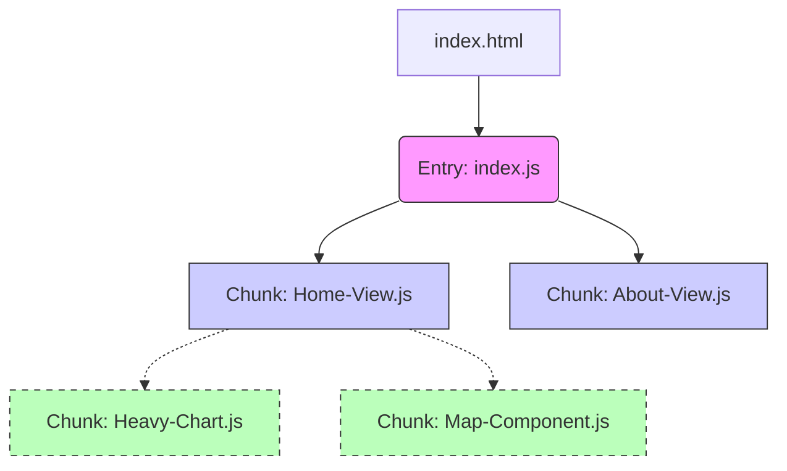

[[toc]]

## 1\. 核心机制解析

在现代前端构建中，**异步加载**直接决定了**打包产物 (Bundles)** 的物理结构。

### 1.1 静态引入 vs 动态引入

  * **静态引入 (`import ... from ...`)**:
      * **构建行为**: 强依赖。构建工具会将依赖的代码直接**合并**到引用它的文件中。
      * **结果**: 单个文件体积膨胀。
  * **动态引入 (`import(...)`)**:
      * **构建行为**: 弱依赖（分割点）。构建工具识别到此语法，会将目标模块**切割**成一个新的文件 (Chunk)。
      * **结果**: 生成独立文件，按需通过网络请求加载。

### 1.2 级联拆分模型

当“路由懒加载”与“组件异步加载”同时存在时，打包会形成树状结构：



  * **实线**: 路由跳转时加载。
  * **虚线**: 组件渲染时（如 `v-if=true`）加载。

-----

## 2\. 代码实现规范

### 2.1 路由级拆分 (必选项)

**场景**: 所有顶级页面 (Views)。
**代码**:

```javascript
// router/index.js
const routes = [
  {
    path: '/dashboard',
    name: 'Dashboard',
    // webpackChunkName 注释在 Webpack 中有用，Vite 中主要靠 rollupOptions 配置命名
    component: () => import('@/views/Dashboard.vue')
  }
]
```

### 2.2 组件级拆分 (按需项)

**场景**:

1.  **大体积组件**: ECharts, Editor, 3D 模型渲染器。
2.  **交互后显示**: 弹窗 (Modal), 抽屉 (Drawer), 底部折叠面板。

**代码**:

```javascript
import { defineAsyncComponent } from 'vue'
import LoadingSkeleton from './LoadingSkeleton.vue'

// 推荐使用对象配置形式，提升体验
const AsyncChart = defineAsyncComponent({
  // 工厂函数
  loader: () => import('./components/HeavyChart.vue'),
  
  // 加载异步组件时使用的组件
  loadingComponent: LoadingSkeleton,
  // 展示加载组件前的延迟时间，默认为 200ms
  delay: 200,
  
  // 加载失败后展示的组件
  errorComponent: ErrorDisplay,
  // 超时时间 (毫秒)
  timeout: 10000
})
```

-----

## 3\. 构建与打包详解 (配置篇)

这是本文档的重点。Vite 底层使用 Rollup 打包，通过 `build.rollupOptions` 可以精准控制产物。

### 3.1 推荐的 `vite.config.js` 配置

```javascript
import { defineConfig } from 'vite'
import vue from '@vitejs/plugin-vue'
import { visualizer } from 'rollup-plugin-visualizer'

export default defineConfig({
  plugins: [
    vue(),
    // 生成依赖分析图 stats.html
    visualizer({ open: true, gzipSize: true })
  ],
  build: {
    // 生产环境通常开启压缩
    minify: 'terser', 
    rollupOptions: {
      output: {
        // --------------------------------------------------
        // 1. 文件命名策略 (File Naming Strategy)
        // --------------------------------------------------
        // 入口文件
        entryFileNames: 'assets/js/[name]-[hash].js',
        // 分包文件 (异步组件/路由)
        // [name] 能够保留组件的文件名，便于调试和排查
        chunkFileNames: 'assets/js/[name]-[hash].js',
        // 静态资源 (CSS, 图片)
        assetFileNames: 'assets/[ext]/[name]-[hash].[ext]',

        // --------------------------------------------------
        // 2. 手动分包策略 (Manual Chunks) - 关键优化
        // --------------------------------------------------
        manualChunks(id) {
          // 策略 A: 提取基础库 (利用浏览器强缓存)
          // 只要是 node_modules 里的 vue 相关全打包进 vue-vendor
          if (id.includes('node_modules')) {
            if (id.includes('vue') || id.includes('pinia') || id.includes('vue-router')) {
              return 'vue-vendor';
            }
            // 策略 B: 提取大体积第三方库
            if (id.includes('echarts') || id.includes('zrender')) {
              return 'echarts-vendor';
            }
            if (id.includes('lodash') || id.includes('dayjs')) {
              return 'utils-vendor';
            }
            
            // 策略 C: 其他所有 node_modules 归为 vendor
            // 注意：如果不细分，vendor.js 会极其巨大，建议按需拆分
            return 'vendor'; 
          }
        }
      }
    }
  }
})
```

### 3.2 策略详解：为什么要 `manualChunks`？

默认情况下，Vite 可能会根据引用关系，把 `node_modules` 里的代码打散在各个业务 Chunk 里，或者全部合并在一起。

  * **问题**: 如果你修改了一行业务代码 (`Home.vue`)，导致 hash 变了，用户重新下载 `Home.js`。如果 `Home.js` 里包含了 `Vue` 的源码，用户就必须重新下载 `Vue`，这很浪费。
  * **优化**: 通过 `manualChunks` 把 `vue`, `vue-router` 这种几年不更新的库单独抽离成 `vue-vendor.js`。
      * **效果**: 修改业务代码 -\> 只有业务 Chunk hash 变了 -\> `vue-vendor.js` 依然命中浏览器缓存 (304 或 Disk Cache)。

-----

## 4\. 打包产物分析

执行 `npm run build` 后，`dist` 目录结构及其含义如下：

```text
dist/
├── index.html
└── assets/
    ├── css/
    │   ├── index-a1b2.css        <-- 全局样式
    │   ├── Home-c3d4.css         <-- 路由级 CSS (懒加载)
    │   └── HeavyChart-e5f6.css   <-- 异步组件级 CSS (按需加载)
    │
    └── js/
        ├── index-x1y2.js         <-- 应用入口 (Main Entry)
        ├── vue-vendor-z3w4.js    <-- [手动分包] Vue 全家桶 (长期缓存)
        ├── echarts-vendor-p5q6.js<-- [手动分包] 图表库
        │
        ├── Home-r7s8.js          <-- [路由 Chunk] 首页业务逻辑
        ├── About-t9u0.js         <-- [路由 Chunk] 关于页业务逻辑
        │
        └── HeavyChart-v1k2.js    <-- [组件 Chunk] 只有渲染时才下载
```

### 4.1 CSS 的特殊处理

Vite/Vue 3 会自动处理异步组件的 CSS。

  * **加载机制**: 当 JavaScript 请求 `HeavyChart.js` 时，会自动创建一个 `<link rel="stylesheet">` 标签去加载 `HeavyChart.css`。
  * **注意**: 确保网络环境较差时，组件不会因为 CSS 加载慢而出现“样式闪烁” (FOUC)。使用 `loadingComponent` (骨架屏) 可以完美掩盖这个过程。

-----

## 5\. 性能与体验权衡 (Checklist)

在决定是否进行拆包时，请对照此表：

| 检查项 | 建议 | 理由 |
| :--- | :--- | :--- |
| **组件体积 \< 5KB** | ❌ 保持同步 | 建立 HTTP 连接的耗时 \> 下载 5KB JS 的耗时。 |
| **首屏核心组件 (Header/Nav)** | ❌ 保持同步 | 避免页面布局抖动 (Layout Shift)。 |
| **低频功能 (设置/详情页)** | ✅ 异步 + 路由懒加载 | 90% 的用户可能根本不需要下载这些代码。 |
| **超大依赖 (Three.js/ECharts)** | ✅ 异步 + 手动分包 | 隔离“巨无霸”文件，防止阻塞主线程解析。 |
| **多个页面共用的组件** | ✅ 异步 | 打包器会自动提取为 Shared Chunk，两个页面共享一份缓存。 |

-----

## 6\. 总结

1.  **分包不是越细越好**：过多的 Chunk 会导致 HTTP/1.1 环境下请求阻塞（虽 HTTP/2 有改善，但仍有开销）。
2.  **`defineAsyncComponent` 是微创手术**：用于解决特定的“大组件”性能瓶颈。
3.  **路由懒加载是基础设施**：所有项目默认必须开启。
4.  **`manualChunks` 是缓存利器**：将第三方库与业务代码分离，是长期缓存策略的核心。