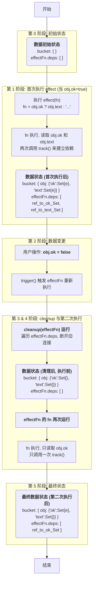
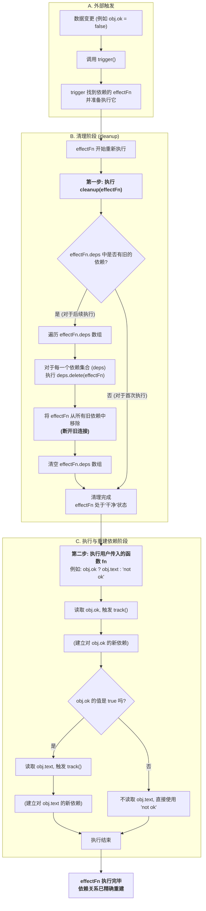
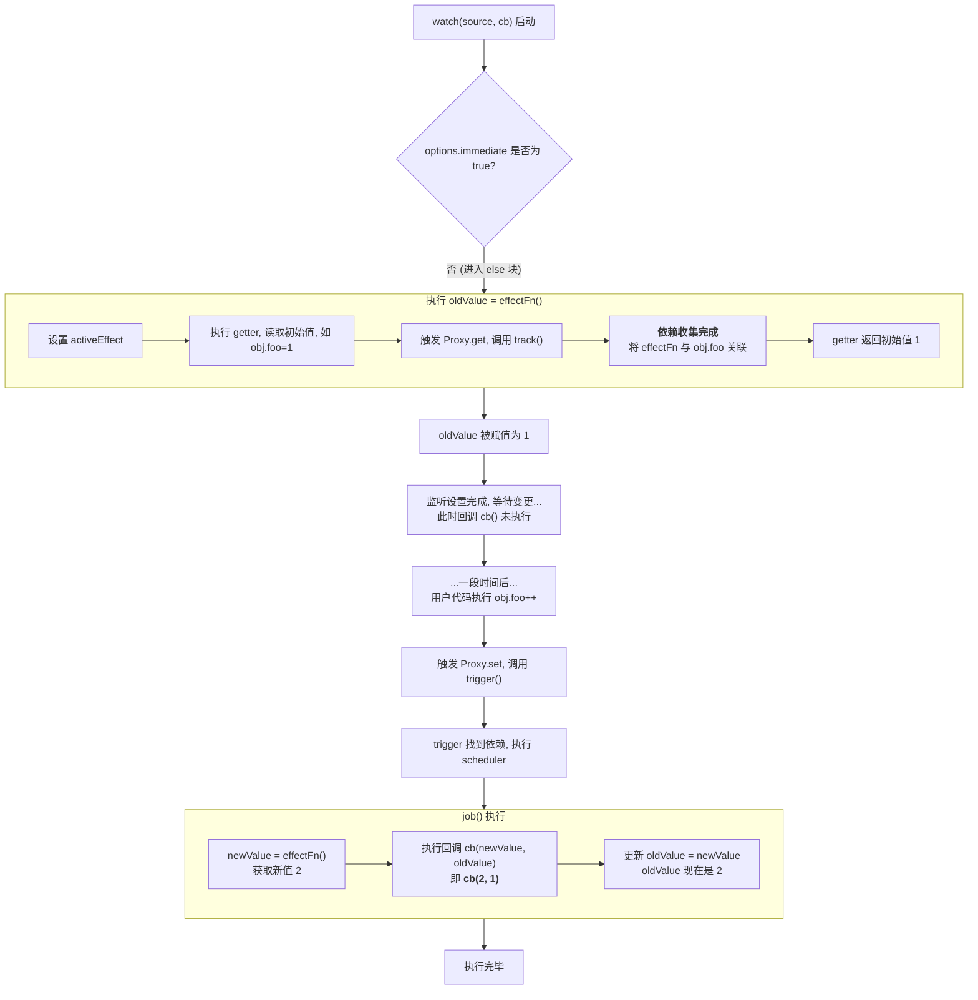
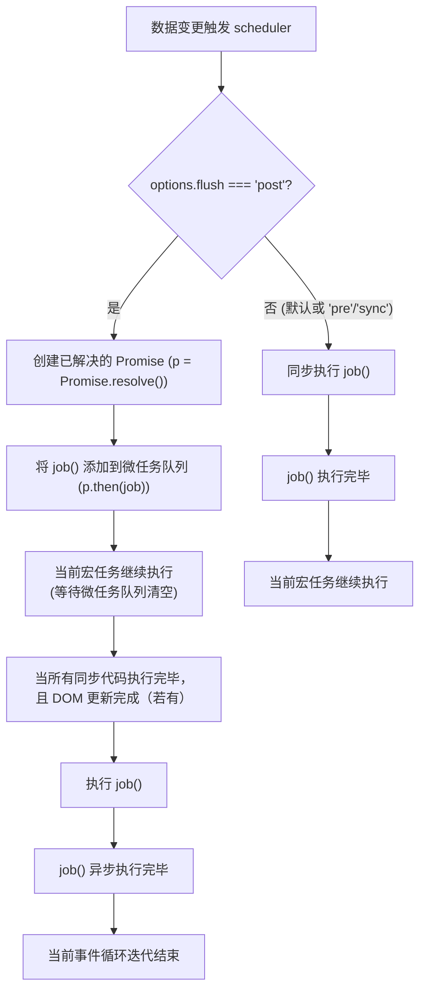

[[toc]]

## Vue3 设计思路

### 声明式UI

描述声明式UI的两种方式：

- DOM元素，属性，事件，元素层级结构（模版）

  ```html
  <h1 @click="handler"><span></span></h1>
  ```

- JS对象

  ```js
  const vnode = {
    tag: 'div',
    props: {
      onClick: () => alert('hello')
    },
    children: 'click me'
  }
  ```

个人理解，声明式UI本质就是描述页面。

JS对象相比模版来说，更加方便灵活，Vue内部就采用JS对象来描述声明式UI，对应的就是Vue里VNode（虚拟dom）。

h函数：

创建虚拟dom的工具函数

```js
import { h } from 'vue'
export default {
	render() {
		return h('h1', { onClick: handler }) // 虚拟 DOM
 	}
}
```

个人理解：每次都自己敲JS对象，会非常麻烦，如果还有子节点，工作量很大。因此使用h函数来辅助创建JS对象（虚拟DOM）。通过传递参数，就能快速创建虚拟dom，减少心智负担。

### 渲染器

把虚拟DOM转换为真实DOM


```js
function renderer(vnode, container) {
  // 使用 vnode.tag 作为标签名称创建 DOM 元素
	const el = document.createElement(vnode.tag)
  // 遍历 vnode.props 将属性、事件添加到 DOM 元素
  for (const key in vnode.props) {
    if (/^on/.test(key)) {
      // 如果 key 以 on 开头，那么说明它是事件
      el.addEventListener(
        key.substr(2).toLowerCase(), // 事件名称 onClick ---> click
        vnode.props[key] // 事件处理函数
      )
    }
  }

  // 处理 children
  if (typeof vnode.children === 'string') {
    // 如果 children 是字符串，说明是元素的文本子节点
    el.appendChild(document.createTextNode(vnode.children))
  } else if (Array.isArray(vnode.children)) {
    // 递归地调用 renderer 函数渲染子节点，使用当前元素 el 作为挂载点
    vnode.children.forEach(child => renderer(child, el))
  }

  // 将元素添加到挂载点下
  container.appendChild(el)
}

const vnode = {
  tag: 'div',
  props: {
    onClick: () => alert('hello')
  },
  children: 'click me'
}

renderer(vnode, document.body)
```

### 组件的本质

组件就是一组 DOM 元素的封装

- 函数描述

  ```js
  const myComponent = () => {
      return {
        tag: 'div',
        props: {
          onClick: () => alert('hello')
        },
        children: 'click me'
      }
    }
  
    const vnode = {
      tag: myComponent
    }
  ```

- 对象描述

  ```js
  const myComponent = {
      render() {
        return {
          tag: 'div',
          props: {
            onClick: () => alert('hello')
          },
          children: 'click me'
        }
      }
    }
  
    const vnode = {
      tag: myComponent
    }
  ```

个人理解：本质还是JS对象（虚拟DOM），封装成函数或者对象便于复用

### 编译器

将`模板`编译为`渲染函数`

模版

```html
<div @click="handler">
 	click me
</div>
```

渲染函数

```js
h('div', { onClick: handler }, 'click me')
```

对于vue来说，template标签包裹的就是模版内容

流程图：


## 响应系统的作用和实现

### 响应式数据和副作用函数

- 副作用函数

  副作用函数`effect`指的是会产生副作用的函数(废话)

  ```js
  function effect() {
      document.body.innerText = 'hello vue3'
  }
  ```

​	个人理解：该函数执行之后，会影响某个变量的值

- 响应式数据

  副作用函数依赖了变量的值，变量的值的改变自动引起副作用函数的执行

  ```js
  const obj = { text: 'hello world' }
  function effect() {
  	// effect 函数的执行会读取 obj.text
  	document.body.innerText = obj.text
  }
  ```

  

### 响应式系统

#### 最简单版本

[Proxy](https://developer.mozilla.org/zh-CN/docs/Web/JavaScript/Reference/Global_Objects/Proxy)

[Set](https://developer.mozilla.org/zh-CN/docs/Web/JavaScript/Reference/Global_Objects/Set)

使用`Proxy`来劫持数据的get和set，`Set`来储存副作用函数

`get`读的时候收集副作用函数

`set`改的时候执行副作用函数

```js
// 存储副作用函数的桶
const bucket = new Set()

// 原始数据
const data = { text: 'hello world' }
// 对原始数据的代理
const obj = new Proxy(data, {
  // 拦截读取操作
  get(target, key) {
    // 将副作用函数 effect 添加到存储副作用函数的桶中
    bucket.add(effect)
    // 返回属性值
    return target[key]
  },
  // 拦截设置操作
  set(target, key, newVal) {
    console.log(target, key, newVal)
    // 设置属性值
    target[key] = newVal
    // 把副作用函数从桶里取出并执行
    bucket.forEach(fn => fn())
  }
})

function effect() {
  document.body.innerText = obj.text
}
effect()
setTimeout(() => {
  // obj是代理对象Proxy
  obj.text = 'hello vue3'
}, 1000)
```

#### 第一次优化

问题：当前副作用函数不够灵活，函数名称限定为`effect`，如果要考虑复用性，也不方便。

新增一个匿名函数`activeEffect`来储存被注册的副作用函数

```js
// 存储副作用函数的桶
const bucket = new Set()

// 原始数据
const data = { text: 'hello world' }
// 对原始数据的代理
const obj = new Proxy(data, {
  // 拦截读取操作
  get(target, key) {
    // 将副作用函数 activeEffect 添加到存储副作用函数的桶中
    bucket.add(activeEffect)
    // 返回属性值
    return target[key]
  },
  // 拦截设置操作
  set(target, key, newVal) {
    // 设置属性值
    target[key] = newVal
    // 把副作用函数从桶里取出并执行
    bucket.forEach(fn => fn())
  }
})


// 用一个全局变量存储当前激活的 effect 函数
let activeEffect
function effect(fn) {
  // 当调用 effect 注册副作用函数时，将副作用函数复制给 activeEffect
  activeEffect = fn
  // 执行副作用函数
  fn()
}

effect(() => {
  console.log('effect run')
  document.body.innerText = obj.text
})

setTimeout(() => {
  obj.text2 = 'hello vue3'
}, 1000)
```

#### 第二次优化

问题：如果给当前的对象`obj`新增一个不存在的属性，会触发`set`函数的执行，正常应该是哪个属性变了就执行那个属性的副作用函数，减少不必要的开销，提升性能。

`target-key-effect`的关系图：


`targert`：代理对象

`key`：对象的key

`effect`：key的副作用函数

[WeakMap](https://developer.mozilla.org/zh-CN/docs/Web/JavaScript/Reference/Global_Objects/WeakMap/WeakMap)

[Map](https://developer.mozilla.org/zh-CN/docs/Web/JavaScript/Reference/Global_Objects/Map)

使用`WeakMap`和`Map`来构建如下关系：

1.`WeakMap`的`key`是对象`Target`

2.`Map`的`key`是对象`Target`的`key`


使用`WeakMap`来储存`target`可以防止内存溢出。`WeakMap`对`key`是弱引用，不影响[垃圾回收](https://developer.mozilla.org/zh-CN/docs/Web/JavaScript/Guide/Memory_management)（简单理解：内存里不使用的对象，JS会自动销毁此对象），因此如果`target`不被使用了，就会被垃圾回收掉。如果使用`Map`，那么会引起不必要的内存开销，如果这个`target`不被使用了。

代码实现：

```js
// 存储副作用函数的桶
const bucket = new WeakMap()

// 原始数据
const data = { text: 'hello world' }
// 对原始数据的代理
const obj = new Proxy(data, {
  // 拦截读取操作
  get(target, key) {
    // 将副作用函数 activeEffect 添加到存储副作用函数的桶中
    let depsMap = bucket.get(target)
    if (!depsMap) {
      bucket.set(target, (depsMap = new Map()))
    }
    let deps = depsMap.get(key)
    if (!deps) {
      depsMap.set(key, (deps = new Set()))
    }
    deps.add(activeEffect)

    // 返回属性值
    return target[key]
  },
  // 拦截设置操作
  set(target, key, newVal) {
    // 设置属性值
    target[key] = newVal
    // 把副作用函数从桶里取出并执行
    const depsMap = bucket.get(target)
    if (!depsMap) return
    const effects = depsMap.get(key)
    effects && effects.forEach(fn => fn())
  }
})


// 用一个全局变量存储当前激活的 effect 函数
let activeEffect
function effect(fn) {
  // 当调用 effect 注册副作用函数时，将副作用函数复制给 activeEffect
  activeEffect = fn
  // 执行副作用函数
  fn()
}

effect(() => {
  console.log('effect run')
  document.body.innerText = obj.text
})

setTimeout(() => {
  obj.text = 'hello vue3'
}, 1000)
```

抽离函数：

把收集副作用的函数提取为`track`和把执行副作用的函数提取为`trigger`

```js
// 存储副作用函数的桶
const bucket = new WeakMap()

// 原始数据
const data = { text: 'hello world' }
// 对原始数据的代理
const obj = new Proxy(data, {
  // 拦截读取操作
  get(target, key) {
    // 将副作用函数 activeEffect 添加到存储副作用函数的桶中
    track(target, key)
    // 返回属性值
    return target[key]
  },
  // 拦截设置操作
  set(target, key, newVal) {
    // 设置属性值
    target[key] = newVal
    // 把副作用函数从桶里取出并执行
    trigger(target, key)
  }
})

function track(target, key) {
  let depsMap = bucket.get(target)
  if (!depsMap) {
    bucket.set(target, (depsMap = new Map()))
  }
  let deps = depsMap.get(key)
  if (!deps) {
    depsMap.set(key, (deps = new Set()))
  }
  deps.add(activeEffect)
}

function trigger(target, key) {
  const depsMap = bucket.get(target)
  if (!depsMap) return
  const effects = depsMap.get(key)
  effects && effects.forEach(fn => fn())
}

// 用一个全局变量存储当前激活的 effect 函数
let activeEffect
function effect(fn) {
  // 当调用 effect 注册副作用函数时，将副作用函数复制给 activeEffect
  activeEffect = fn
  // 执行副作用函数
  fn()
}

effect(() => {
  console.log('effect run')
  document.body.innerText = obj.text
})

setTimeout(() => {
  trigger(data, 'text')
}, 1000)

```

#### 第三次优化

如果存在下面这种依赖关系，`ok`为`true`，就会显示`text`字段的内容。

```js
const data = { ok: true, text: 'hello world' }
const obj = new Proxy(data, { /* ... */ })

effect(function effectFn() {
	document.body.innerText = obj.ok ? obj.text : 'not'
})
```

依赖关系关系图：


`text`和`ok`的副作用函数`effect`都会在`get`的时候被依赖收集`track`。

现在存在一个问题，如果把`ok`改为`false`，此时派发更新`trigger`，更新`innerText`的值为`not`。但是后续如果修改`text`的值也会触发`trigger`，但是此时的innerText一直是`not`，并不依赖`text`，因此存在遗留的副作用函数。

```mermaid
graph TD
    subgraph "A. 首次执行 (当 obj.ok 为 true)"
        A1["首次执行 effectFn"] --> A2["(跳过) <b>没有 cleanup 阶段</b>"];
        A2 --> A3["执行用户函数 fn<br>obj.ok ? obj.text : 'not ok'"];
        A3 --> A4["读取 obj.ok (true) 和 obj.text"];
        A4 --> A5["通过 track() 建立依赖关系"];
        A5 --> A6["<b>当前依赖: {obj.ok, obj.text}</b><br>此时依赖是正确的"];
    end

    A6 --> B1["...一段时间后...<br>用户代码执行 <b>obj.ok = false</b>"];
    B1 --> B2["trigger() 触发 effectFn 重新执行"];

    subgraph "B. 第二次执行 (当 obj.ok 为 false)"
        B2 --> C1["effectFn 开始重新执行"];
        C1 --> C2["(跳过) <b>没有 cleanup 阶段</b>"];
        C2 --> C3["执行用户函数 fn<br>obj.ok ? obj.text : 'not ok'"];
        C3 --> C4["只读取 obj.ok (false)"];
        C4 --> C5["通过 track() 重新建立对 obj.ok 的依赖"];
        C5 --> C6["<b>执行结束<br>但对 obj.text 的旧依赖从未被清除</b>"];
    end

    C6 --> D1["<b style='color:red;'>错误状态: 当前依赖仍为 {obj.ok, obj.text}</b><br>但逻辑上应只依赖 obj.ok"];

    subgraph "C. 错误的后果"
        D1 --> E1["...又过了一段时间...<br>用户执行了逻辑上无关的操作:<br><b>obj.text = 'new message'</b>"];
        E1 --> E2["调用 trigger(obj, 'text')"];
        E2 --> E3["trigger 在 obj.text 的依赖集合中<br>找到了那个从未被清除的'僵尸依赖' (effectFn)"];
        E3 --> E4["<b>不必要地重新执行了 effectFn !</b>"];
    end

    %% 样式
    style A2 fill:red,stroke:#333,stroke-width:2px
    style C2 fill:red,stroke:#333,stroke-width:2px
    style D1 fill:#f99,stroke:#b00,stroke-width:4px
    style E4 fill:#f99,stroke:#b00,stroke-width:4px
```



新增一个`cleanup`函数来清除遗留的副作用函数

在副作用函数执行之前，先清除之前的遗留副作用函数

```js
// 存储副作用函数的桶
const bucket = new WeakMap()

// 原始数据
const data = { ok: true, text: 'hello world' }
// 对原始数据的代理
const obj = new Proxy(data, {
  // 拦截读取操作
  get(target, key) {
    // 将副作用函数 activeEffect 添加到存储副作用函数的桶中
    track(target, key)
    // 返回属性值
    return target[key]
  },
  // 拦截设置操作
  set(target, key, newVal) {
    // 设置属性值
    target[key] = newVal
    // 把副作用函数从桶里取出并执行
    trigger(target, key)
  }
})

function track(target, key) {
  let depsMap = bucket.get(target)
  if (!depsMap) {
    bucket.set(target, (depsMap = new Map()))
  }
  let deps = depsMap.get(key)
  if (!deps) {
    depsMap.set(key, (deps = new Set()))
  }
  deps.add(activeEffect)
  activeEffect.deps.push(deps)
}

function trigger(target, key) {
  const depsMap = bucket.get(target)
  if (!depsMap) return
  const effects = depsMap.get(key)
  effects && effects.forEach(effectFn => effectFn())
}

// 用一个全局变量存储当前激活的 effect 函数
let activeEffect
function effect(fn) {
  const effectFn = () => {
    cleanup(effectFn)
    // 当调用 effect 注册副作用函数时，将副作用函数复制给 activeEffect
    activeEffect = effectFn
    fn()
  }
  // activeEffect.deps 用来存储所有与该副作用函数相关的依赖集合
  effectFn.deps = []
  // 执行副作用函数
  effectFn()
}

function cleanup(effectFn) {
  for (let i = 0; i < effectFn.deps.length; i++) {
    const deps = effectFn.deps[i]
    deps.delete(effectFn)
  }
  effectFn.deps.length = 0
}

effect(() => {
  console.log('effect run')
  document.body.innerText = obj.ok ? obj.text : 'not'
})

```

`cleanup`执行流程图：



依赖收集之后会存在如下关系


给`effectFn`上新增`deps`储存依赖集合，在依赖收集阶段和`activeEffect`构建依赖集合。cleanup函数的参数为副作用函数`effectFn`，在执行副作用函数之前，会清除`activeEffect`中的`deps`里的副作用函数依赖集合。`effectFn.deps.length = 0`清空当前的依赖集合数组。

整个执行流程：




#### 第四次优化

现在还存在一个问题，现在`trigger`执行副作用函数的时候会导致死循环。

```js
// 存储副作用函数的桶
const bucket = new WeakMap()

// 原始数据
const data = { ok: true, text: 'hello world' }
// 对原始数据的代理
const obj = new Proxy(data, {
  // 拦截读取操作
  get(target, key) {
    // 将副作用函数 activeEffect 添加到存储副作用函数的桶中
    track(target, key)
    // 返回属性值
    return target[key]
  },
  // 拦截设置操作
  set(target, key, newVal) {
    // 设置属性值
    target[key] = newVal
    // 把副作用函数从桶里取出并执行
    trigger(target, key)
  }
})

function track(target, key) {
  let depsMap = bucket.get(target)
  if (!depsMap) {
    bucket.set(target, (depsMap = new Map()))
  }
  let deps = depsMap.get(key)
  if (!deps) {
    depsMap.set(key, (deps = new Set()))
  }
  deps.add(activeEffect)
  activeEffect.deps.push(deps)
}

function trigger(target, key) {
  const depsMap = bucket.get(target)
  if (!depsMap) return
  const effects = depsMap.get(key)
  effects && effects.forEach(effectFn => effectFn())
}

// 用一个全局变量存储当前激活的 effect 函数
let activeEffect
function effect(fn) {
  const effectFn = () => {
    cleanup(effectFn)
    // 当调用 effect 注册副作用函数时，将副作用函数复制给 activeEffect
    activeEffect = effectFn
    fn()
  }
  // activeEffect.deps 用来存储所有与该副作用函数相关的依赖集合
  effectFn.deps = []
  // 执行副作用函数
  effectFn()
}

function cleanup(effectFn) {
  for (let i = 0; i < effectFn.deps.length; i++) {
    const deps = effectFn.deps[i]
    deps.delete(effectFn)
  }
  effectFn.deps.length = 0
}

effect(() => {
  console.log('effect run')
  document.body.innerText = obj.ok ? obj.text : 'not'
})

```

当`trigger`遍历`effects`执行`effectFn`的时候（此时会读取`data`上`ok`字段值），执行`fn`会触发`track`，`track`里又会执行`deps.add(activeEffect)`，导致` effects && effects.forEach(effectFn => effectFn())`出现死循环，`effects`里一直会有副作用函数（当前`key`的`effects`）。

问题关键：

```js
function trigger(target, key) {
  const depsMap = bucket.get(target)
  if (!depsMap) return
  const effects = depsMap.get(key)
  effects && effects.forEach(effectFn => effectFn()) // 死循环
}
```

流程如下：


解决方法：

new一个新的set集合，保证内存地址指向不是同一个。

```js
function trigger(target, key) {
  const depsMap = bucket.get(target)
  if (!depsMap) return
  const effects = depsMap.get(key)

  const effectsToRun = new Set()
  effects && effects.forEach(effectFn => effectsToRun.add(effectFn))
  effectsToRun.forEach(effectFn => effectFn())
  // effects && effects.forEach(effectFn => effectFn())
}
```


#### 第五次优化

`effectFn`嵌套导致依赖收集的副作用函数出现问题

何时出现`effectFn`嵌套？当某个组件内部渲染了另外一个组件


此时相当于：


用如下代码举例：

```js
// 原始数据
const data = { foo: true, bar: true }
// 对原始数据的代理
const obj = new Proxy(data, {
// 拦截读取操作
get(target, key) {
  // 将副作用函数 activeEffect 添加到存储副作用函数的桶中
  track(target, key)
  // 返回属性值
  return target[key]
},
// 拦截设置操作
set(target, key, newVal) {
  // 设置属性值
  target[key] = newVal
  // 把副作用函数从桶里取出并执行
  trigger(target, key)
}
}) 
// 省略....
effect(() => {
	console.log('effect run1')
	effect(() => {
		 console.log('effect run2')
		 let temp = obj.bar
	})	
	let temp = obj.foo
})

setTimeout(() => {
	obj.foo = false
}, 1000)
```

此时`effect`内部发生了嵌套，此时会导致一个问题，对`obj`的`foo`进行`track`的时候，`foo`的`effectFn`是`effectFn2`，导致如果修改`foo`的值为`true`，执行`effectFn2`。


流程图如下：


优化代码：

使用栈来解决，每次调用副作用函数`effectFn`之前，把函数放入栈`effectStack`中，执行完毕之后再弹出栈，并把栈顶指向`activeEffect`，用于还原之前的值。

流程如下图：


代码：

```js
// 用一个全局变量存储当前激活的 effect 函数
let activeEffect
// effect 栈
const effectStack = []
function effect(fn) {
  const effectFn = () => {
    cleanup(effectFn)
    // 当调用 effect 注册副作用函数时，将副作用函数复制给 activeEffect
    activeEffect = effectFn
    // 在调用副作用函数之前将当前副作用函数压栈
    effectStack.push(effectFn)
    fn()
    // 在当前副作用函数执行完毕后，将当前副作用函数弹出栈，并还原 activeEffect 为之前的值
    effectStack.pop()
    activeEffect = effectStack[effectStack.length - 1]
  }
  // activeEffect.deps 用来存储所有与该副作用函数相关的依赖集合
  effectFn.deps = []
  // 执行副作用函数
  effectFn()
}
```

#### 第六次优化

避免无限递归循环

如果副作用函数如下：

```js
effect(() => {
	obj.foo++  // obj.foo = obj.foo + 1
})
```

执行流程图如下：


当`trigger`的时候，执行副作用函数，此时`effectsToRun.forEach(effectFn => effectFn())`还没有执行完毕，执行副作用函数的时候又进行`track`和`trigger`导致无限循环。

```js
function trigger(target, key) {
  const depsMap = bucket.get(target)
  if (!depsMap) return
  const effects = depsMap.get(key)

  const effectsToRun = new Set()
  effects && effects.forEach(effectFn => effectsToRun.add(effectFn))
  effectsToRun.forEach(effectFn => effectFn())
}
```

解决方法：

```js
function trigger(target, key) {
  const depsMap = bucket.get(target)
  if (!depsMap) return
  const effects = depsMap.get(key)

  const effectsToRun = new Set()
  effects && effects.forEach(effectFn => {
    // 如果当前执行的副作用函数和trigger的副作用函数一样，则不执行
    if (effectFn !== activeEffect) {
      effectsToRun.add(effectFn) 
    }
  })
  effectsToRun.forEach(effectFn => effectFn())
}
```

#### 第七次优化

调度执行优化，连续多次修改响应式数据，只触发一次更新。

副作用函数如下：

```js
effect(() => {
  console.log(obj.foo)
})

obj.foo++
obj.foo++
```

当`foo++`连续两次，我们只关心`foo`的结果，不关心过程，但这个时候副作用函数会执行两次，输出结果为：

```js
1
2
3
```

我们只关心最终结果，期望输出：

```js
1
3
```

解决方法：

新增配置项`options`，通过配置`scheduler`来控制调度执行，使用`Set`（去重，如果有相同的副作用函数）来储存`jobQueue`任务队列，把副作用函数放入到微任务队列，当`trigger`的时候执行`scheduler`，执行`jobQueue`中的函数

```js
// 存储副作用函数的桶
const bucket = new WeakMap()

// 原始数据
const data = { foo: 1 }
// 对原始数据的代理
const obj = new Proxy(data, {
  // 拦截读取操作
  get(target, key) {
    // 将副作用函数 activeEffect 添加到存储副作用函数的桶中
    track(target, key)
    // 返回属性值
    return target[key]
  },
  // 拦截设置操作
  set(target, key, newVal) {
    // 设置属性值
    target[key] = newVal
    // 把副作用函数从桶里取出并执行
    trigger(target, key)
  }
})

function track(target, key) {
  if (!activeEffect) return
  let depsMap = bucket.get(target)
  if (!depsMap) {
    bucket.set(target, (depsMap = new Map()))
  }
  let deps = depsMap.get(key)
  if (!deps) {
    depsMap.set(key, (deps = new Set()))
  }
  deps.add(activeEffect)
  activeEffect.deps.push(deps)
}

function trigger(target, key) {
  const depsMap = bucket.get(target)
  if (!depsMap) return
  const effects = depsMap.get(key)

  const effectsToRun = new Set()
  effects && effects.forEach(effectFn => {
    if (effectFn !== activeEffect) {
      effectsToRun.add(effectFn)
    }
  })
  effectsToRun.forEach(effectFn => {
    if (effectFn.options.scheduler) {
      effectFn.options.scheduler(effectFn)
    } else {
      effectFn()
    }
  })
  // effects && effects.forEach(effectFn => effectFn())
}

// 用一个全局变量存储当前激活的 effect 函数
let activeEffect
// effect 栈
const effectStack = []

function effect(fn, options = {}) {
  const effectFn = () => {
    cleanup(effectFn)
    // 当调用 effect 注册副作用函数时，将副作用函数复制给 activeEffect
    activeEffect = effectFn
    // 在调用副作用函数之前将当前副作用函数压栈
    effectStack.push(effectFn)
    fn()
    // 在当前副作用函数执行完毕后，将当前副作用函数弹出栈，并还原 activeEffect 为之前的值
    effectStack.pop()
    activeEffect = effectStack[effectStack.length - 1]
  }
  // 将 options 挂在到 effectFn 上
  effectFn.options = options
  // activeEffect.deps 用来存储所有与该副作用函数相关的依赖集合
  effectFn.deps = []
  // 执行副作用函数
  effectFn()
}

function cleanup(effectFn) {
  for (let i = 0; i < effectFn.deps.length; i++) {
    const deps = effectFn.deps[i]
    deps.delete(effectFn)
  }
  effectFn.deps.length = 0
}


// =========================

const jobQueue = new Set()
const p = Promise.resolve()

let isFlushing = false
function flushJob() {
  if (isFlushing) return
  isFlushing = true
  p.then(() => {
    jobQueue.forEach(job => job())
  }).finally(() => {
    isFlushing = false
  })
}


effect(() => {
  console.log(obj.foo)
}, {
  scheduler(fn) {
    jobQueue.add(fn)
    flushJob()
  }
})

obj.foo++
obj.foo++
```

流程图如下：


### computed

#### effectFn懒执行

`options`新增配置项`lazy`（`lazy`为`true`就立即执行`effectFn`），`effect`里返回`effectFn`（用于手动执行副作用函数`effectFn`），`effectFn`里返回`fn`函数执行后的返回值。

现在实现一个简单的`computed`，`getter`返回一个函数，函数返回值依赖其他的值，当读取对象`obj`的值的时候触发`get`，执行`effectFn`

```js
  // 存储副作用函数的桶
  const bucket = new WeakMap()

  // 原始数据
  const data = { foo: 1, bar: 2 }
  // 对原始数据的代理
  const obj = new Proxy(data, {
    // 拦截读取操作
    get(target, key) {
      // 将副作用函数 activeEffect 添加到存储副作用函数的桶中
      track(target, key)
      // 返回属性值
      return target[key]
    },
    // 拦截设置操作
    set(target, key, newVal) {
      // 设置属性值
      target[key] = newVal
      // 把副作用函数从桶里取出并执行
      trigger(target, key)
    }
  })

  function track(target, key) {
    if (!activeEffect) return
    let depsMap = bucket.get(target)
    if (!depsMap) {
      bucket.set(target, (depsMap = new Map()))
    }
    let deps = depsMap.get(key)
    if (!deps) {
      depsMap.set(key, (deps = new Set()))
    }
    deps.add(activeEffect)
    activeEffect.deps.push(deps)
  }

  function trigger(target, key) {
    const depsMap = bucket.get(target)
    if (!depsMap) return
    const effects = depsMap.get(key)

    const effectsToRun = new Set()
    effects && effects.forEach(effectFn => {
      if (effectFn !== activeEffect) {
        effectsToRun.add(effectFn)
      }
    })
    effectsToRun.forEach(effectFn => {
      if (effectFn.options.scheduler) {
        effectFn.options.scheduler(effectFn)
      } else {
        effectFn()
      }
    })
  }

  // 用一个全局变量存储当前激活的 effect 函数
  let activeEffect
  // effect 栈
  const effectStack = []

  function effect(fn, options = {}) {
    const effectFn = () => {
      cleanup(effectFn)
      // 当调用 effect 注册副作用函数时，将副作用函数复制给 activeEffect
      activeEffect = effectFn
      // 在调用副作用函数之前将当前副作用函数压栈
      effectStack.push(effectFn)
      const res = fn()
      // 在当前副作用函数执行完毕后，将当前副作用函数弹出栈，并还原 activeEffect 为之前的值
      effectStack.pop()
      activeEffect = effectStack[effectStack.length - 1]

      return res
    }
    // 将 options 挂在到 effectFn 上
    effectFn.options = options
    // activeEffect.deps 用来存储所有与该副作用函数相关的依赖集合
    effectFn.deps = []
    // 执行副作用函数
    if (!options.lazy) {
      effectFn()
    }

    return effectFn
  }

  function cleanup(effectFn) {
    for (let i = 0; i < effectFn.deps.length; i++) {
      const deps = effectFn.deps[i]
      deps.delete(effectFn)
    }
    effectFn.deps.length = 0
  }
  // =========================
  function computed(getter) {
    const effectFn = effect(getter, {
      lazy: true
    })
    const obj = {
      get value() {
        return effectFn()
      }
    }
    return obj
  }
  const sumRes = computed(() => obj.foo + obj.bar)
  console.log(sumRes.value)
  console.log(sumRes.value)
```

#### computed懒执行

现在存在一个问题，当我连续读取`sumRes.value`，会连续多次执行`effectFn`，但如果这个时候依赖项`obj.foo`和`obj.bar`没有变化，但也多次执行`effectFn`，并没有缓存效果。这个时候可以新增一个变量`dirty`来标志是否需要重新计算值，如果`dirty`为`true`，执行`effectFn`。如果`dirty`为`false`则不执行，并重置`dirty`为`true`。如果依赖项`obj.foo`和`obj.bar`发生了变化，`dirty`重置为`true`，这个时候需要去执行`effectFn`，获取最新的值，可以通过在`options`里配置`scheduler`来重置`dirty`为`true`。

```js
  // 存储副作用函数的桶
  const bucket = new WeakMap()

  // 原始数据
  const data = { foo: 1, bar: 2 }
  // 对原始数据的代理
  const obj = new Proxy(data, {
    // 拦截读取操作
    get(target, key) {
      // 将副作用函数 activeEffect 添加到存储副作用函数的桶中
      track(target, key)
      // 返回属性值
      return target[key]
    },
    // 拦截设置操作
    set(target, key, newVal) {
      // 设置属性值
      target[key] = newVal
      // 把副作用函数从桶里取出并执行
      trigger(target, key)
    }
  })

  function track(target, key) {
    if (!activeEffect) return
    let depsMap = bucket.get(target)
    if (!depsMap) {
      bucket.set(target, (depsMap = new Map()))
    }
    let deps = depsMap.get(key)
    if (!deps) {
      depsMap.set(key, (deps = new Set()))
    }
    deps.add(activeEffect)
    activeEffect.deps.push(deps)
  }

  function trigger(target, key) {
    const depsMap = bucket.get(target)
    if (!depsMap) return
    const effects = depsMap.get(key)

    const effectsToRun = new Set()
    effects && effects.forEach(effectFn => {
      if (effectFn !== activeEffect) {
        effectsToRun.add(effectFn)
      }
    })
    effectsToRun.forEach(effectFn => {
      if (effectFn.options.scheduler) {
        effectFn.options.scheduler(effectFn)
      } else {
        effectFn()
      }
    })
  }

  // 用一个全局变量存储当前激活的 effect 函数
  let activeEffect
  // effect 栈
  const effectStack = []

  function effect(fn, options = {}) {
    const effectFn = () => {
      cleanup(effectFn)
      // 当调用 effect 注册副作用函数时，将副作用函数复制给 activeEffect
      activeEffect = effectFn
      // 在调用副作用函数之前将当前副作用函数压栈
      effectStack.push(effectFn)
      const res = fn()
      // 在当前副作用函数执行完毕后，将当前副作用函数弹出栈，并还原 activeEffect 为之前的值
      effectStack.pop()
      activeEffect = effectStack[effectStack.length - 1]

      return res
    }
    // 将 options 挂在到 effectFn 上
    effectFn.options = options
    // activeEffect.deps 用来存储所有与该副作用函数相关的依赖集合
    effectFn.deps = []
    // 执行副作用函数
    if (!options.lazy) {
      effectFn()
    }

    return effectFn
  }

  function cleanup(effectFn) {
    for (let i = 0; i < effectFn.deps.length; i++) {
      const deps = effectFn.deps[i]
      deps.delete(effectFn)
    }
    effectFn.deps.length = 0
  }
  // =========================
  function computed(getter) {
    let dirty = true
    let value
    const effectFn = effect(getter, {
      lazy: true,
      scheduler(){
          dirty = true
      }
    })
    const obj = {
      get value() {
        if(dirty) {
            value = effectFn()
            dirty = false
        }
        return value
      }
    }
    return obj
  }
  const sumRes = computed(() => obj.foo + obj.bar)
  console.log(sumRes.value)
  console.log(sumRes.value)

  obj.foo++
  console.log(sumRes.value)
```

流程如下：


`track`依赖收集的时候，`activeEffect`此时已被赋值为`effectFn`，副作用函数是`effectFn`，函数内部的`fn`是`getter`，`options`的配置是计算属性的参数配置，如下：

```js
{
      lazy: true,
      scheduler(){
          dirty = true
      }
 }
```

当执行`trigger`，会执行`scheduler`来重置`dirty`

```js
function trigger(target, key) {
    const depsMap = bucket.get(target)
    if (!depsMap) return
    const effects = depsMap.get(key)

    const effectsToRun = new Set()
    effects && effects.forEach(effectFn => {
      if (effectFn !== activeEffect) {
        effectsToRun.add(effectFn)
      }
    })
    effectsToRun.forEach(effectFn => {
      if (effectFn.options.scheduler) {
        // 执行
        effectFn.options.scheduler(effectFn)
      } else {
        effectFn()
      }
    })
  }
```

#### computed中的effect嵌套

如果出现`effect`中使用`computed`，由于内部`obj.foo`和`obj.bar`的`effect`的收集不会受外部影响，因为每次都会对当前`effectStack`进行出栈和入栈，来保证`activeEffect`指向之前的值。会导致obj.foo++的时候，`trigger`不会触发`() => {console.log(sumRes.value)}`的执行。

```js
const sumRes = computed(() => {
	return obj.foo + obj.bar
})
effect(() => {
	console.log(sumRes.value)
})
obj.foo++
```

```js
3  // 第一次打印 1 + 2
```

执行流程图如下：


解决方法：

当`computed`的`obj`进行`get`的时候手动触发`track`，但依赖项的发生改变，触发`trigger`的时候再手动执行`obj`的`trigger`

```js
// 存储副作用函数的桶
const bucket = new WeakMap()

// 原始数据
const data = { foo: 1, bar: 2 }
// 对原始数据的代理
const obj = new Proxy(data, {
  // 拦截读取操作
  get(target, key) {
    // 将副作用函数 activeEffect 添加到存储副作用函数的桶中
    track(target, key)
    // 返回属性值
    return target[key]
  },
  // 拦截设置操作
  set(target, key, newVal) {
    // 设置属性值
    target[key] = newVal
    // 把副作用函数从桶里取出并执行
    trigger(target, key)
  }
})

function track(target, key) {
  if (!activeEffect) return
  let depsMap = bucket.get(target)
  if (!depsMap) {
    bucket.set(target, (depsMap = new Map()))
  }
  let deps = depsMap.get(key)
  if (!deps) {
    depsMap.set(key, (deps = new Set()))
  }
  deps.add(activeEffect)
  activeEffect.deps.push(deps)
}

function trigger(target, key) {
  const depsMap = bucket.get(target)
  if (!depsMap) return
  const effects = depsMap.get(key)

  const effectsToRun = new Set()
  effects && effects.forEach(effectFn => {
    if (effectFn !== activeEffect) {
      effectsToRun.add(effectFn)
    }
  })
  effectsToRun.forEach(effectFn => {
    if (effectFn.options.scheduler) {
      effectFn.options.scheduler(effectFn)
    } else {
      effectFn()
    }
  })
  // effects && effects.forEach(effectFn => effectFn())
}

// 用一个全局变量存储当前激活的 effect 函数
let activeEffect
// effect 栈
const effectStack = []

function effect(fn, options = {}) {
  const effectFn = () => {
    cleanup(effectFn)
    // 当调用 effect 注册副作用函数时，将副作用函数复制给 activeEffect
    activeEffect = effectFn
    // 在调用副作用函数之前将当前副作用函数压栈
    effectStack.push(effectFn)
    const res = fn()
    // 在当前副作用函数执行完毕后，将当前副作用函数弹出栈，并还原 activeEffect 为之前的值
    effectStack.pop()
    activeEffect = effectStack[effectStack.length - 1]

    return res
  }
  // 将 options 挂在到 effectFn 上
  effectFn.options = options
  // activeEffect.deps 用来存储所有与该副作用函数相关的依赖集合
  effectFn.deps = []
  // 执行副作用函数
  if (!options.lazy) {
    effectFn()
  }

  return effectFn
}

function cleanup(effectFn) {
  for (let i = 0; i < effectFn.deps.length; i++) {
    const deps = effectFn.deps[i]
    deps.delete(effectFn)
  }
  effectFn.deps.length = 0
}


// =========================

function computed(getter) {
  let value
  let dirty = true

  const effectFn = effect(getter, {
    lazy: true,
    scheduler() {
      if (!dirty) {
        dirty = true
         // 手动对obj进行trigger
        trigger(obj, 'value')
      }
    }
  })
  
  const obj = {
    get value() {
      if (dirty) {
        value = effectFn()
        dirty = false
      }
      // 手动对obj进行track，此时的副作用函数为 () => {console.log(sumRes.value)}
      track(obj, 'value')
      return value
    }
  }

  return obj
}

const sumRes = computed(() => obj.foo + obj.bar)

console.log(sumRes.value)
console.log(sumRes.value)

obj.foo++

console.log(sumRes.value)

effect(() => {
  console.log(sumRes.value)
})

obj.foo++
```

这个时候会打印两次：

```js
3  // 第一次打印 1 + 2
4  // 第二次打印 2 + 2
```

### watch

[wacth文档](https://cn.vuejs.org/api/reactivity-core.html#watch)

`watch`相比`computed`，函数的参数不一样，`watch`的参数可能为对象也可能为一个函数`getter`，如果为对象，需要遍历读取这个对象，把对象上的所有key都`track`，因此通过`traverse`函数来遍历读取对象的所有属性。

`traverse`的实现：

递归来遍历对象，对象里面可能会嵌套对象。

```js
function traverse(value, seen = new Set()) {
  if (typeof value !== 'object' || value === null || seen.has(value)) return
  seen.add(value)
  for (const k in value) {
    traverse(value[k], seen)
  }
  return value
}
```

`wacth`可以立即执行，配置`options.immediate = true`，相当于立即执行`job()`，此时的`oldValue = undefined`，`newValue = effectFn()`，其中`effectFn()`为该函数首次运行的值。配置`options.immediate = false`，不会立即执行（并且`{ lazy: true }`），但是为了触发依赖收集`track`，必须执行`oldValue = effectFn`。

配置`options.immediate = false`的执行流程：



代码实现：

```js
function watch(source, cb, options = {}) {
  let getter
  if (typeof source === 'function') {
    getter = source
  } else {
    getter = () => traverse(source)
  }

  let oldValue, newValue

  const job = () => {
    newValue = effectFn()
    cb(oldValue, newValue)
    oldValue = newValue
  }

  const effectFn = effect(
    // 执行 getter
    () => getter(),
    {
      lazy: true,
      scheduler: () => {
        if (options.flush === 'post') {
          const p = Promise.resolve()
          p.then(job)
        } else {
          job()
        }
      }
    }
  )
  
  if (options.immediate) {
    job()
  } else {
    oldValue = effectFn()
  }
}
```

`watch`的`flush`配置，如果`options.flush === 'post'`，把`job`放入到微任务队列。来确保执行之前`DOM`的更新已经完成，获取到最新的`DOM`状态

流程图如下：



代码实现：

```js
const effectFn = effect(
    // 执行 getter
    () => getter(),
    {
      lazy: true,
      scheduler: () => {
        if (options.flush === 'post') {
          const p = Promise.resolve()
          p.then(job)
        } else {
          job()
        }
      }
    }
  )
```

最终代码实现：

```js
// 存储副作用函数的桶
const bucket = new WeakMap()

// 原始数据
const data = { foo: 1, bar: 2 }
// 对原始数据的代理
const obj = new Proxy(data, {
  // 拦截读取操作
  get(target, key) {
    // 将副作用函数 activeEffect 添加到存储副作用函数的桶中
    track(target, key)
    // 返回属性值
    return target[key]
  },
  // 拦截设置操作
  set(target, key, newVal) {
    // 设置属性值
    target[key] = newVal
    // 把副作用函数从桶里取出并执行
    trigger(target, key)
  }
})

function track(target, key) {
  if (!activeEffect) return
  let depsMap = bucket.get(target)
  if (!depsMap) {
    bucket.set(target, (depsMap = new Map()))
  }
  let deps = depsMap.get(key)
  if (!deps) {
    depsMap.set(key, (deps = new Set()))
  }
  deps.add(activeEffect)
  activeEffect.deps.push(deps)
}

function trigger(target, key) {
  const depsMap = bucket.get(target)
  if (!depsMap) return
  const effects = depsMap.get(key)

  const effectsToRun = new Set()
  effects && effects.forEach(effectFn => {
    if (effectFn !== activeEffect) {
      effectsToRun.add(effectFn)
    }
  })
  effectsToRun.forEach(effectFn => {
    if (effectFn.options.scheduler) {
      effectFn.options.scheduler(effectFn)
    } else {
      effectFn()
    }
  })
  // effects && effects.forEach(effectFn => effectFn())
}

// 用一个全局变量存储当前激活的 effect 函数
let activeEffect
// effect 栈
const effectStack = []

function effect(fn, options = {}) {
  const effectFn = () => {
    cleanup(effectFn)
    // 当调用 effect 注册副作用函数时，将副作用函数复制给 activeEffect
    activeEffect = effectFn
    // 在调用副作用函数之前将当前副作用函数压栈
    effectStack.push(effectFn)
    const res = fn()
    // 在当前副作用函数执行完毕后，将当前副作用函数弹出栈，并还原 activeEffect 为之前的值
    effectStack.pop()
    activeEffect = effectStack[effectStack.length - 1]

    return res
  }
  // 将 options 挂在到 effectFn 上
  effectFn.options = options
  // activeEffect.deps 用来存储所有与该副作用函数相关的依赖集合
  effectFn.deps = []
  // 执行副作用函数
  if (!options.lazy) {
    effectFn()
  }

  return effectFn
}

function cleanup(effectFn) {
  for (let i = 0; i < effectFn.deps.length; i++) {
    const deps = effectFn.deps[i]
    deps.delete(effectFn)
  }
  effectFn.deps.length = 0
}


// =========================

function traverse(value, seen = new Set()) {
  if (typeof value !== 'object' || value === null || seen.has(value)) return
  seen.add(value)
  for (const k in value) {
    traverse(value[k], seen)
  }

  return value
}

function watch(source, cb, options = {}) {
  let getter
  if (typeof source === 'function') {
    getter = source
  } else {
    getter = () => traverse(source)
  }

  let oldValue, newValue

  const job = () => {
    newValue = effectFn()
    cb(oldValue, newValue)
    oldValue = newValue
  }

  const effectFn = effect(
    // 执行 getter
    () => getter(),
    {
      lazy: true,
      scheduler: () => {
        if (options.flush === 'post') {
          const p = Promise.resolve()
          p.then(job)
        } else {
          job()
        }
      }
    }
  )
  
  if (options.immediate) {
    job()
  } else {
    oldValue = effectFn()
  }
}

watch(() => obj.foo, (newVal, oldVal) => {
  console.log(newVal, oldVal)
}, {
  immediate: true,
  flush: 'post'
})

setTimeout(() => {
  obj.foo++
}, 1000)
```

