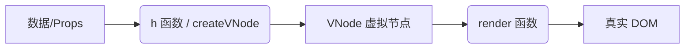

[[toc]]

在 Vue 的日常开发中，我们通常使用 `<template>` 编写界面。然而，在开发组件库（如 Element Plus）或需要高度动态的交互（如指令式调用的弹窗）时，我们需要直接操作 Vue 的底层渲染管线。这就涉及到了两个核心 API：`h` 和 `render`。

## 1. 核心概念与关系

如果把构建 Vue 页面比作盖房子，那么：

* **`h` 函数（Architect / 设计师）**：负责绘制“图纸”。它不直接操作 DOM，而是生成描述 DOM 结构的 JavaScript 对象（即 VNode）。
* **`render` 函数（Builder / 施工队）**：负责根据“图纸”施工。它读取 VNode，通过复杂的 Diff 算法，将其转换为浏览器中真实的 DOM 节点并挂载到指定容器中。

### 1.1 流程图解



---

## 2. 深度剖析 `h` 函数

`h` 是 **Hyperscript** 的缩写，意思是 "script that generates HTML structures"。

* **本质**：它是 `createVNode` 的用户友好型封装。
* **作用**：**生产**虚拟节点（VNode）。
* **返回值**：一个纯 JavaScript 对象，描述了节点的信息（标签名、属性、子节点等）。

### 2.1 基础用法

```typescript
import { h } from 'vue'

// 1. 创建原生元素
// <div class="box">Hello</div>
const vnode1 = h('div', { class: 'box' }, 'Hello')

// 2. 创建组件
// <MyComponent title="Title" />
import MyComponent from './MyComponent.vue'
const vnode2 = h(MyComponent, { title: 'Title' })

```

### 2.2 `h` vs `createVNode`

在查看源码或编写库时，你常会看到 `createVNode`。

* **`h`**：参数灵活（多态），开发体验好。通常用于手写 `render` 选项或 JSX 转换目标。
* **`createVNode`**：参数严格，性能稍高。通常用于库的底层实现或编译器生成的代码。

---

## 3. 深度剖析 `render` 函数

`render` 是 Vue 运行时渲染器暴露出的核心接口。

* **本质**：Vue 的 DOM Patch 引擎入口。
* **作用**：**消费**虚拟节点，执行 DOM 挂载、更新和卸载。
* **副作用**：它会直接修改浏览器的 DOM 树。

### 3.1 核心签名

```typescript
type RenderFunction = (vnode: VNode | null, container: HostElement) => void
```

### 3.2 关键行为

1. **挂载 (Mount)**: 当 `container` 为空时，将 VNode 转换成 DOM 插入。
2. **更新 (Patch)**: 当 `container` 已有 VNode 时，比较新旧 VNode，只更新变化的部分。
3. **卸载 (Unmount)**: 当传入的 `vnode` 为 `null` 时，触发生命周期销毁钩子（`onUnmounted`），并从 DOM 中移除元素。

---

## 4. 实战应用：从零实现函数式 Confirm 组件

结合上述理论，我们通过实现一个类似 `ElMessageBox.confirm` 的组件，来展示如何脱离 Vue 的组件树（Template），手动控制组件的**创建**与**销毁**。

### 4.1 架构设计

我们需要在一个普通的 TS 函数中完成以下闭环：

1. **DOM 层**：创建一个临时的 `div` 容器。
2. **VNode 层**：使用 `createVNode` 将 Vue 组件转换为虚拟节点，并注入 Props。
3. **渲染层**：使用 `render` 将 VNode 挂载到容器。
4. **逻辑层**：通过 Promise 管理用户点击确认/取消的状态，并在结束时清理 DOM。

### 4.2 完整代码实现

**UI 组件 (`ConfirmComponent.vue`)**
负责展示，不包含业务逻辑，只通过 `props` 接收回调。

```vue
<template>
  <Transition name="fade">
    <div v-if="visible" class="confirm-mask" @click.self="handleCancel">
      <div class="confirm-box">
        <MyTest ref="myTestRef" title="my-test" buttonText="click me" />
        <div class="header">{{ title }}</div>
        <div class="content">{{ content }}</div>
        <div class="footer">
          <button class="btn cancel" @click="handleCancel">{{ cancelText }}</button>
          <button class="btn confirm" @click="handleConfirm">{{ confirmText }}</button>
        </div>
      </div>
    </div>
  </Transition>
</template>
<script setup lang="ts">
import { nextTick, ref } from 'vue'
import MyTest from '@/components/my-test/index.vue'
// 定义 Props
interface Props {
  title?: string
  content?: string
  confirmText?: string
  cancelText?: string
  // 这两个回调由函数封装层传入
  onConfirm?: () => void
  onCancel?: () => void
}

const props = withDefaults(defineProps<Props>(), {
  title: '提示',
  content: '确定要执行此操作吗？',
  confirmText: '确定',
  cancelText: '取消',
})

const myTestRef = ref<InstanceType<typeof MyTest>>()

// 控制显示隐藏 (用于处理进出场动画)
const visible = ref(false)

// 打开弹窗（由外部调用）
const show = () => {
  visible.value = true
  nextTick(() => {
    myTestRef.value?.sayHello()
  })
}

// 内部处理点击事件
const handleConfirm = () => {
  visible.value = false
  // 稍微延迟销毁，等待动画结束
  setTimeout(() => {
    props.onConfirm?.()
  }, 300)
}

const handleCancel = () => {
  visible.value = false
  setTimeout(() => {
    props.onCancel?.()
  }, 300)
}

// 暴露 show 方法给外部
defineExpose({
  show,
})
</script>


<style scoped lang="scss">
/* 简单样式 */
.confirm-mask {
  position: fixed;
  top: 0;
  left: 0;
  width: 100vw;
  height: 100vh;
  background: rgba(0, 0, 0, 0.5);
  display: flex;
  justify-content: center;
  align-items: center;
  z-index: 9999;
}
.confirm-box {
  background: white;
  padding: 20px;
  border-radius: 8px;
  width: 300px;
  box-shadow: 0 2px 12px 0 rgba(0, 0, 0, 0.1);
}
.header {
  font-weight: bold;
  font-size: 16px;
  margin-bottom: 10px;
}
.content {
  margin-bottom: 20px;
  color: #666;
}
.footer {
  display: flex;
  justify-content: flex-end;
  gap: 10px;
}
.btn {
  padding: 6px 15px;
  border: 1px solid #dcdfe6;
  background: white;
  cursor: pointer;
  border-radius: 4px;
}
.confirm {
  background: #409eff;
  color: white;
  border-color: #409eff;
}

/* 动画定义 */
.fade-enter-active,
.fade-leave-active {
  transition: opacity 0.3s;
}
.fade-enter-from,
.fade-leave-to {
  opacity: 0;
}
</style>

```

**函数式封装 (`index.ts`)**
这是 `h` (createVNode) 和 `render` 发挥作用的地方。

```typescript
// index.ts
import { createVNode, render } from 'vue'
import ConfirmComponent from './index.vue'
// 定义配置项接口
interface ConfirmOptions {
  title?: string
  content: string
  confirmText?: string
  cancelText?: string
}

export const Confirm = (options: ConfirmOptions): Promise<void> => {
  return new Promise((resolve, reject) => {
    // 1. 创建一个挂载容器 (div)
    // 也可以复用容器，但创建新的最简单，避免状态污染
    const container = document.createElement('div')
    document.body.appendChild(container)

    // 2. 销毁实例的辅助函数
    const destroy = () => {
      // 卸载组件
      render(null, container)
      // 移除 DOM
      container.remove()
    }

    // 3. 创建 VNode
    // 第二个参数 props 会直接传递给组件
    const vnode = createVNode(ConfirmComponent, {
      ...options,
      // 传递回调函数，组件内部触发这些函数时，我们处理 Promise 状态
      onConfirm: () => {
        resolve()
        destroy()
      },
      onCancel: () => {
        reject(new Error('cancel'))
        destroy()
      }
    })

    // 4. 渲染 VNode 到容器中
    render(vnode, container)

    // 5. 调用组件内部的 show 方法来触发显示（配合动画）
    // vnode.component.exposed 包含了 defineExpose 暴露的内容
    // 这里的类型断言是为了让 TS 知道有 show 方法
    const componentInstance = vnode.component?.exposed as { show: () => void }
    if (componentInstance) {
      componentInstance.show()
    }
  })
}

```

---

## 5. 进阶思考：Template 到底是什么？

理解了 `h` 和 `render`，你就能理解 `.vue` 文件的本质。

Vue 的编译器（Compiler）做的工作，本质上就是把 `<template>` 翻译成一个 `render` 函数。

**源代码：**

```vue
<template>
  <div id="app">Vue</div>
</template>

```

**编译后（近似）：**

```javascript
import { h } from 'vue'

export default {
  render() {
    return h('div', { id: 'app' }, 'Vue')
  }
}

```

### 总结

* **`<template>`** 是给开发者看的语法糖。
* **`h` / `createVNode**` 是生成虚拟 DOM 的工具。
* **`render`** 是将虚拟 DOM 变为真实 DOM 的引擎。
* **函数式组件调用**（如 `Confirm`）的本质，就是手动执行了一次 Vue 内部自动完成的 `createVNode -> render` 流程。